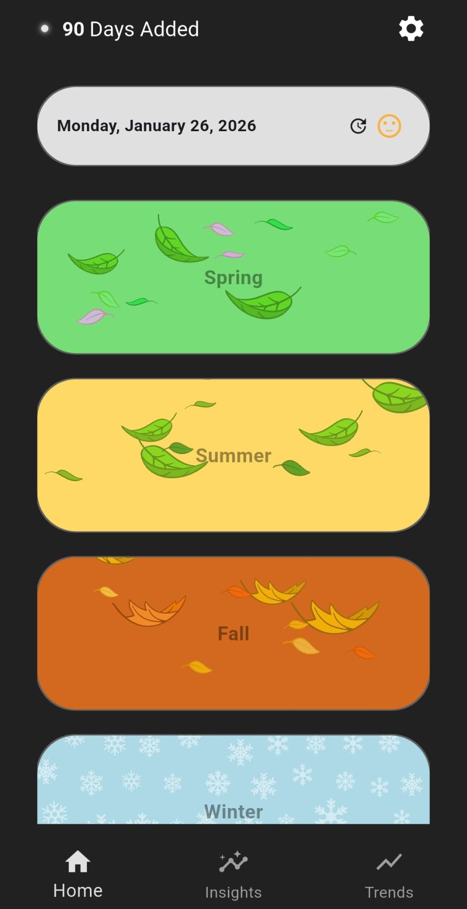
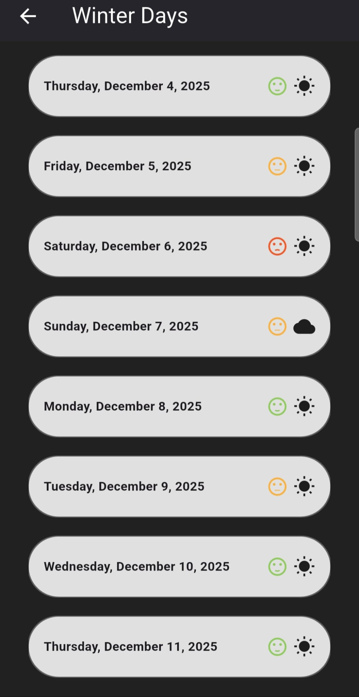
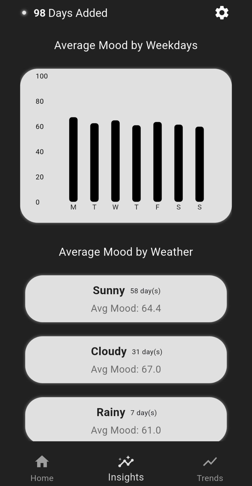
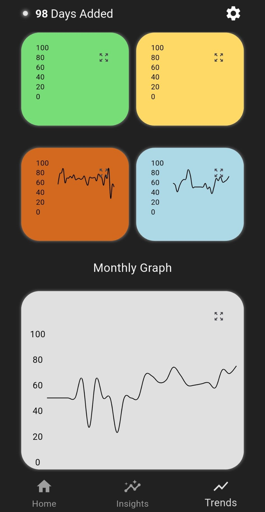

# InnerWeather (Flutter)

<p align="start">
  
</p>

A **privacy-first mood tracking mobile application** built with Flutter.  
All data is stored **locally on the device**

---

## Features

-  Daily mood tracking (0–100 scale)
-  Weather selection for each day
-  Optional personal notes
-  Visual analytics (line charts)
-  Local JSON-based data storage
-  Manual backup & restore via JSON export/import
-  100% offline & private

---

##  Screenshots

<p align="center">
  
  
  
  
</p>

---

##  Tech Stack

- **Flutter**
- **Dart**
- Provider (state management)
- FL Chart (data visualization)
- SharedPreferences (local persistence)

---

##  Data & Privacy

- All user data is stored **locally on the device**
- No internet connection required
- No analytics, ads, or third-party tracking
- Users can export their data as a JSON file and restore it later

---

##  Getting Started

```bash
git clone https://github.com/aozkurt/innerweather.git
cd innerweather
flutter pub get
flutter run
